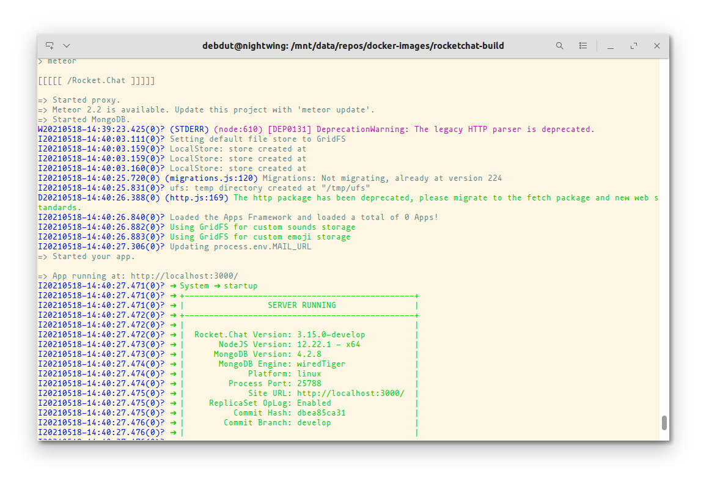

The [official documentation](https://developer.rocket.chat/guides/developer/quick-start-on-linux) recommends you must use a *CLEAN* system for building and running RocketChat for development. If you don't already have such a clean system or you don't want to remove your pre-existing node, for example, you can still test RocketChat on that machine, by simply doing all that from a container.

If you don't know anything about docker or containers, it doesn't matter, the whole point of me spending time on this is to make sure you can still work without having to learn about these things (but I recommend you do learn docker, it's quite simple, trust me).

> Make sure docker and docker-compose both are installed on the system.

## 1. Create a project directory

Generally, you'd work in the top directory of a git repo, in this case, the project directory is going to be one step up. For example, create a directory named `RocketChatBuild`. 

```
mkdir RocketChatBuild
```

This would be your project directory now. You'll clone the RocketChat repository here.

```
git clone https://github.com/rocketchat/rocket.chat
```

Your directory structure should look like this:-

```
debdut@nightwing:/tmp$ tree -L 1 RocketChatBuild/
RocketChatBuild/
└── rocket.chat

1 directory, 0 files
```

## 2. Download the compose file and helper script

Copy and paste the following snippet on your terminal to download the compose file and the helper script.

```shell
for file in docker-compose.yml build_and_run; do
    wget https://raw.githubusercontent.com/debdutdeb/docker-images/main/rocketchat-build/$file
done
```

Make the script executable.

```
chmod +x build_and_run
```

## 3. Build and run

Now after making your desired changes, if you want to build and run RocketChat, move back to the project top directory, in my example case it'd be `RocketChatBuild`, and run `./build_and_run rocket.chat`. The script only takes one argument, and that is the location of the RocketChat git repository. Now, wait until you see it running. After a while, you should see a screen like the following:-



Now head over to https://localhost:3000 , Rocket.Chat will be there waiting for you, with all its glory.